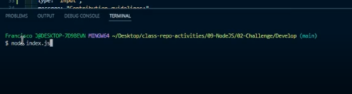
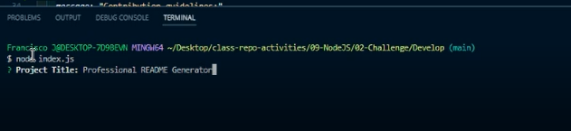
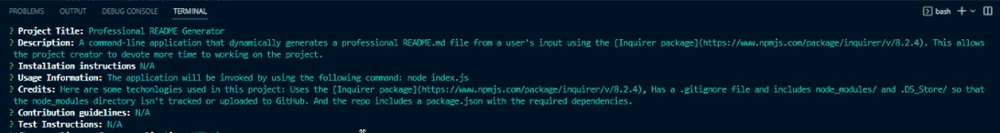
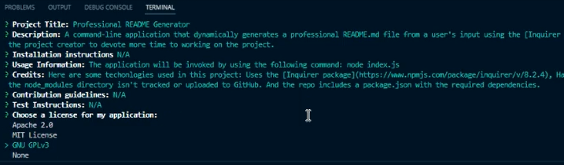
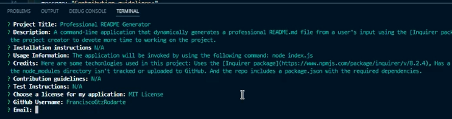
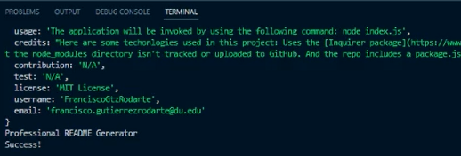
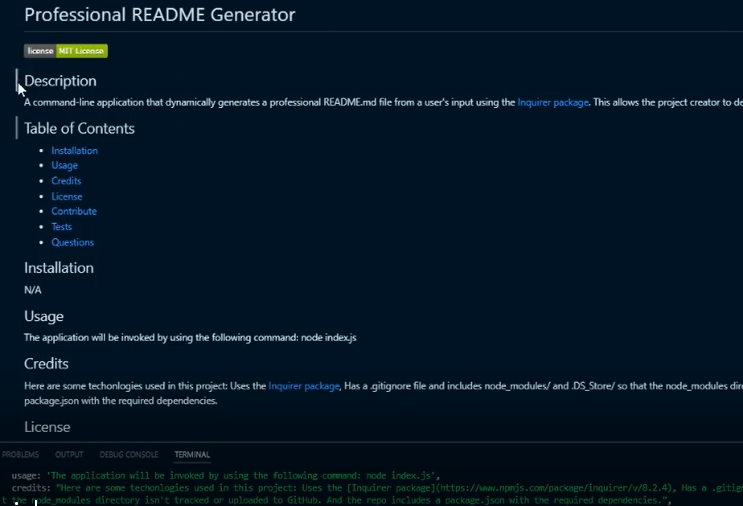

# Professional README Generator

## Description

A command-line application that dynamically generates a professional README.md file from a user's input using the [Inquirer package](https://www.npmjs.com/package/inquirer/v/8.2.4). This allows the project creator to devote more time to working on the project.

When creating an open source project on GitHub, it’s important to have a high-quality README for the app. This should include what the app is for, how to use the app, how to install it, how to report issues, and how to make contributions&mdash;this last part increases the likelihood that other developers will contribute to the success of the project.

## Table of Contents

- [Installation](#installation)
- [Usage](#usage)
- [Credits](#credits)
- [License](#license)
- [Contribute](#contribute)
- [Tests](#tests)
- [Questions](#questions)

## User Story

```md
AS A developer
I WANT a README generator
SO THAT I can quickly create a professional README for a new project
```

## Acceptance Criteria

```md
GIVEN a command-line application that accepts user input
WHEN I am prompted for information about my application repository
THEN a high-quality, professional README.md is generated with the title of my project and sections entitled Description, Table of Contents, Installation, Usage, License, Contributing, Tests, and Questions
WHEN I enter my project title
THEN this is displayed as the title of the README
WHEN I enter a description, installation instructions, usage information, contribution guidelines, and test instructions
THEN this information is added to the sections of the README entitled Description, Installation, Usage, Contributing, and Tests
WHEN I choose a license for my application from a list of options
THEN a badge for that license is added near the top of the README and a notice is added to the section of the README entitled License that explains which license the application is covered under
WHEN I enter my GitHub username
THEN this is added to the section of the README entitled Questions, with a link to my GitHub profile
WHEN I enter my email address
THEN this is added to the section of the README entitled Questions, with instructions on how to reach me with additional questions
WHEN I click on the links in the Table of Contents
THEN I am taken to the corresponding section of the README
```

## Installation

N/A

## Usage

1. The application will be invoked by using the following command: node index.js.

   

2. Then the app will ask for the project title.

   

3. Installation instructions, Usage information, Credits, Contribute guidelines, Tests instructions.

   

4. Then you can choose of a list the type of license you will use.

   

5. And finally type your Github username and email for contact information.

   

6. Youll will see a success message once you enter correctly all the information.

   

7. This is a sample of the genereatd README.

   

## Credits

Here are some techonlogies used in this project: Uses the [Inquirer package](https://www.npmjs.com/package/inquirer/v/8.2.4), Has a .gitignore file and includes node_modules/ and .DS_Store/ so that the node_modules directory isn't tracked or uploaded to GitHub. And the repo includes a package.json with the required dependencies.

## License

    N/A

## Contribute

N/A

## Tests

N/A

## Questions

Github Username: [FranciscoGtzRodarte](https://github.com/FranciscoGtzRodarte)

If you have any aditional questions, you can reach me by E-mail: [francisco.gutierrezrodarte@du.edu](francisco.gutierrezrodarte@du.edu).

## GitHub Repo

[Readme Generator](https://github.com/FranciscoGtzRodarte/readme-generator)

## Thank You
